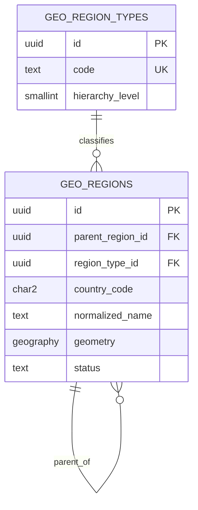
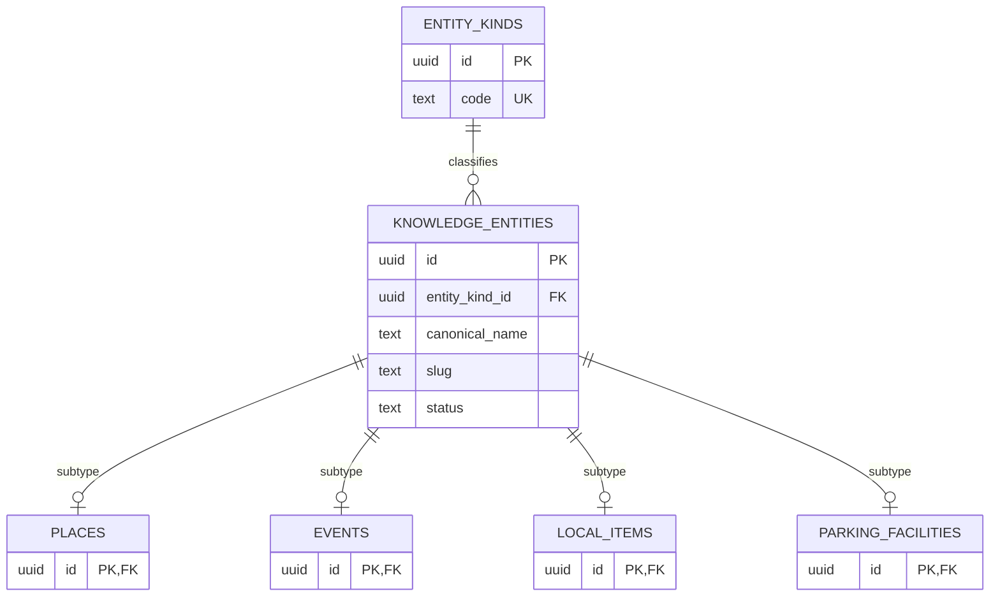
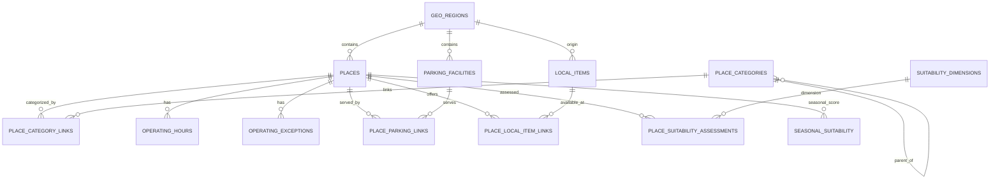
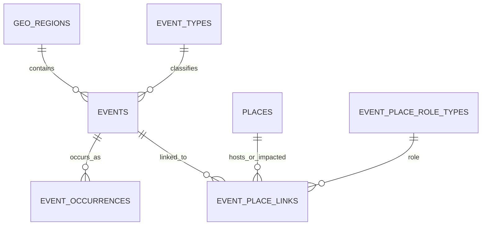
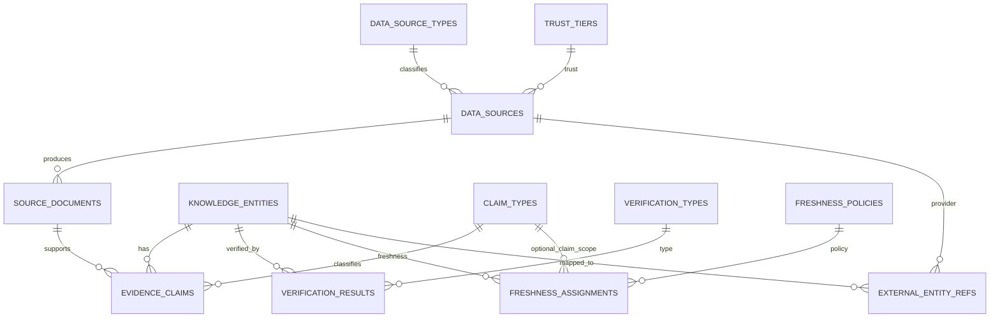
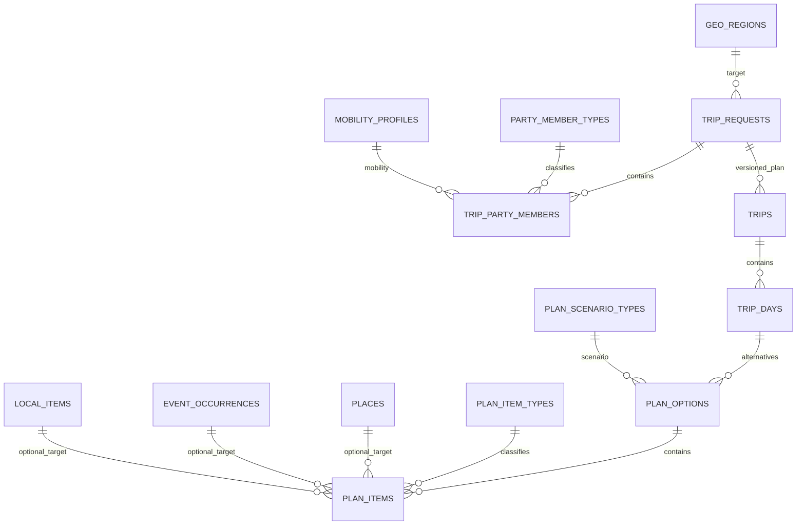
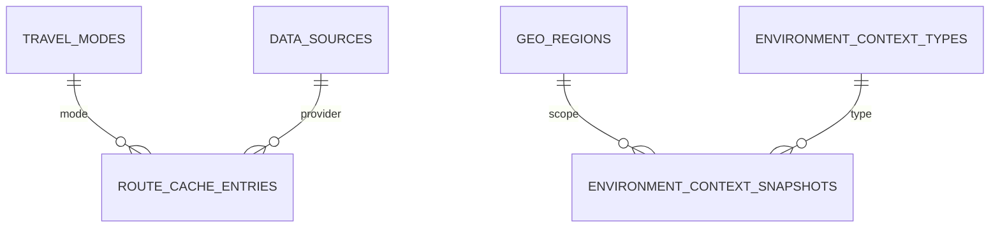

# Tatil Modu — ER Diagram v1

## Durum

**Canonical status:** Domain Model v1 baseline adayı ile birlikte değerlendirilir.

Bu doküman ilişkisel modeli bounded-context bazında görselleştirir. Tek bir dev diyagram yerine okunabilir alt diyagramlar kullanılır.

## 1. Geography

## 2. Knowledge supertype and subtype ownership

## 3. Places and local experience

## 4. Events

## 5. Evidence, provenance, verification and freshness

## 6. Trip request and planning runtime

## 7. Route cache and live context

## 8. Kritik cardinality ve ownership kuralları

- `knowledge_entities -> subtype` ilişkisi 1 -> 0..1 ve subtype PK aynı zamanda FK'dir.
- `place <-> category`, `place <-> parking`, `place <-> local_item`, `event <-> place` N:N join tablolarıyla modellenir.
- `event -> occurrence` 1:N'dir; tekrar eden etkinliğin gerçek tarih örnekleri ayrıdır.
- `trip_request -> trips` 1:N'dir; her plan revizyonu yeni `plan_version` üretir.
- `trip -> trip_days -> plan_options -> plan_items` composition zinciridir ve parent silinirse child'lar CASCADE ile temizlenebilir.
- evidence/source/history ilişkileri RESTRICT ağırlıklıdır; kanıt geçmişi parent lifecycle değişikliğinde sessizce silinmez.
- `plan_items` polymorphic string FK kullanmaz; hedefler nullable gerçek FK'lerdir ve semantic trigger ile tip/hedef uyumu korunur.

## 9. Bounded-context sınırları

### Geography
`geo_region_types`, `geo_regions`

### Travel Knowledge Core
`knowledge_entities`, `places`, `events`, `local_items`, `parking_facilities` ve bağlı registry/join tabloları.

### Trust & Evidence
`data_sources`, `source_documents`, `evidence_claims`, `verification_results`, `freshness_*`, `external_entity_refs`.

### Runtime Planning
`trip_requests`, `trip_party_members`, `trips`, `trip_days`, `plan_options`, `plan_items`.

### Ephemeral/Cache
`route_cache_entries`, `environment_context_snapshots`.

Bu sınırlar ileride repository/service ownership ve migration paketlerini ayırmak için kullanılmalıdır.
